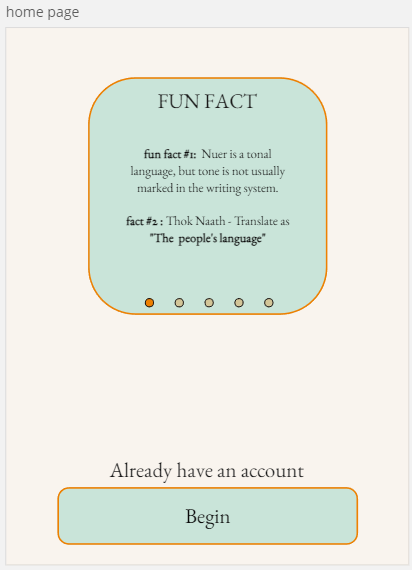
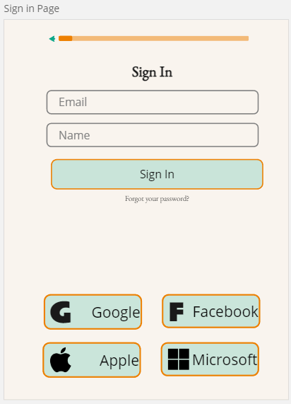
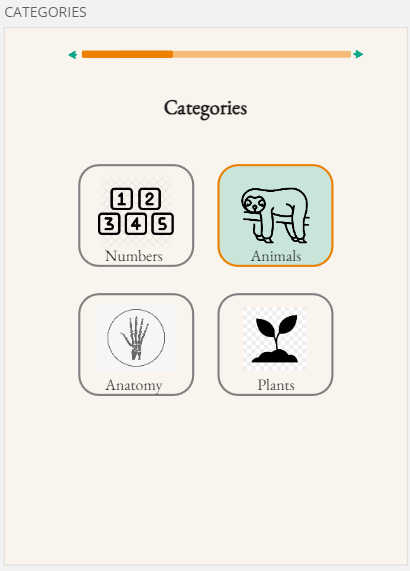
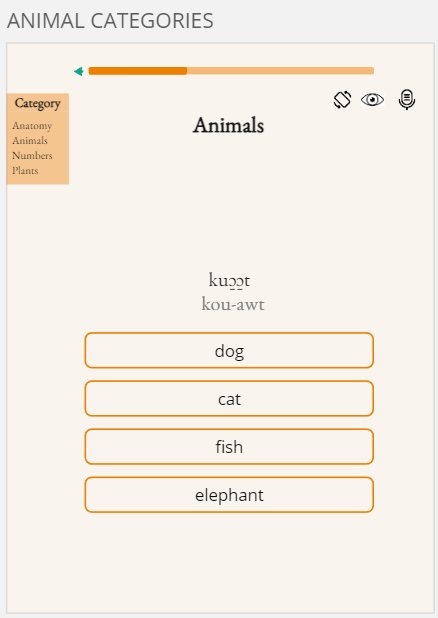
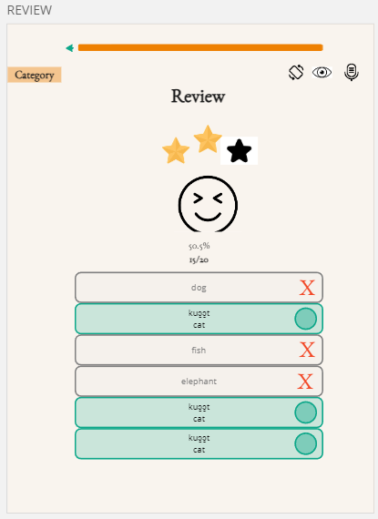

Thok Naath (Nuer) - The people's Language

## Overview

This app will provide individuals with the basic knowledge of the Nuer people language. This will begin with the Alphabet and the will tackle basic categories such as numbers, animals, anatomy and plants.

This app will provide users with the introductory to the Nuer people language called Thok Naath. It will provide the alphabets and quiz users on categories such as Numbers, Animals, Anatomy and Plants. It will also provide users with small facts about the Nuer culture and people.

##### Problem

The app is needed mostly for the Nuer community that are displaced around the world. Many of the children like myself are forgetting their native tong due to being second or even third generation. This is a great way to bridge the gap between English and Thok Naath.

### User Profile

Anyone can use my app all they need to do is create an account or connect there google, facebook or microsoft account to log in.

The app will be very user friendly with easy to read text as well as info graphics to help the users understand what they are reading.

### Features

- easy buttons to click for the alphabets
- category list which will then take users to the next page and quiz them with simple easy to read words
- drop down button for the categories if they choose to go back
- blue correct function to show users that they have got the right answer.
- rotation button for the phone
- eye button for not displaying the image if users choose to make it harder.
- speech function for the vocalization of the word.
- rewarding star symbol for being correct and the percentage of correct answers.
- review of all the answers correct or otherwise.
- back function for users

## Implementation

I will be using React

### Tech Stack

-

### APIs

I will not be using and API for this app, I will be recording my own voice for the pronunciation.

- source of web pages
  https://www.nuerlexicon.com/search.php?id=269
  https://dlib.indiana.edu/collections/nuer/grammar/nuersound.utx.html
  https://www.omniglot.com/writing/nuer.htm
  https://www.sil.org/system/files/reapdata/10/06/46/100646256099282892829790816212446104791/OPSL_9.pdf

### Sitemap

Page #1 -Home page

- This page will have Fun fact of small history lesson of the the Nuer culture and Language. This will be a slideshow that will sometimes have images or just facts.
- The front page will have the button to click to log in.

Page #2 -Sign in Page

- will include the back button
- sign in page for users to create their own user and password or they can log in via social media
- they will also have the function to reset their password.

Page #3 -Basic Alphabet

- This page will have the basic alphabet for the Nuer Languge and a youtube link to click to here the pronunciations.

Page #4 -Categories

- This page will have 4 categories ( Numbers, Animals, Anatomy and Plants)
- each user will have a chance to select what they would like to be quizzed from

Page #5 - After selecting the Category

- when users select a Category they will have a chance to read the word in the Nuer Language and select the correct English word.
- they can choose to not have a photo displayed or hear the pronunciation
- once a correct answer is selected users will be displayed a pleasing green color of the selected object

Page #5 -Review

- users will have the chance to look at all there answers whether it is correct or not. They will get the change to see their scores and rewarded with stars and a cute image.

### Mockups

### Data

Creating my own Data

- slide show
- Alphabets
- category (animals, plans, anotomy and numbers)

### Endpoints

TBD

### Auth

Users will have the need to create an account and the information will be stored.

## Roadmap

Spring #1

- create the server with all the data bases

Sprint #2

- In the client side - create reusable components
- get request
- basic structure of the app including all the links that are required
- set up fonts
- set up drop down menu with link

## Nice-to-haves

- It would be great to have word to speech especially the alphabets since the language is so tonal.
- It would be great to have the ability to choose the tribe you are coming from such as Dinka, Acholi,Shilluk, Luo,Azande,Didinga and much more. This would allow the app to be used by all South Sudanes tribes and truly become inclusive in all language for the region.
- Advance phrases that could be stringed together separated into books each one more advanced then the other.
  The app could have links to websites for cultural education and maybe events in the community in the country you are from.

##### Introduction to Thok Naath:

Provide a section introducingthe Thok Naath language, its history, and significance within the Nuer culture.
Include an alphabet section where users can learn and practice the Thok Naath alphabet.
Educational Modules:

##### Educational Modules:

Categorize lessons into sections such as Numbers, Animals, Anatomy, and Plants.
Each section should include lessons on vocabulary, pronunciation guides, and perhaps images for better understanding.
Quizzes and Challenges:

##### Quizzes and Challenges:

Implement quizzes to reinforce learning in each category.
Progressively unlock more difficult levels as users advance, keeping them engaged and motivated.
Cultural Insights:

##### Cultural Insights:

Provide interesting facts and insights about the Nuer culture and people to enhance users' overall understanding.
Share stories or anecdotes related to language usage and cultural practices.
Interactive Features:

##### Interactive Features

Include interactive elements like pronunciation practice, where users can record and compare their pronunciation with native speakers.
Allow users to ask questions or seek clarification on language nuances.
Progress Tracking:

##### Progress Tracking:

Incorporate a progress tracking system to help users see their improvement over time.
Reward users for completing lessons and achieving milestones.
Community Engagement:

##### Community Engagement:

Include a community forum or chat feature where users can connect, share their progress, and ask questions.
Encourage users to share their experiences with Thok Naath and the Nuer culture.
Regular Updates:

##### Regular Updates:

Keep the app dynamic by regularly updating content, adding new lessons, quizzes, and cultural insights.
User-Friendly Design:

##### User-Friendly Design:

Ensure the app has an intuitive and user-friendly interface, making it accessible for users of all ages.
Feedback Mechanism:

##### Feedback Mechanism:

Include a feedback system to gather user opinions and suggestions for improvement.
Before finalizing the app, it would be beneficial to collaborate with native speakers or experts in the Thok Naath language and Nuer culture to ensure accuracy and cultural sensitivity in the content. Additionally, considering accessibility features and multiple learning styles can enhance the overall user experience.

I enjoy learning, designing and solving problems to improve the lives of everyone on the daily.
